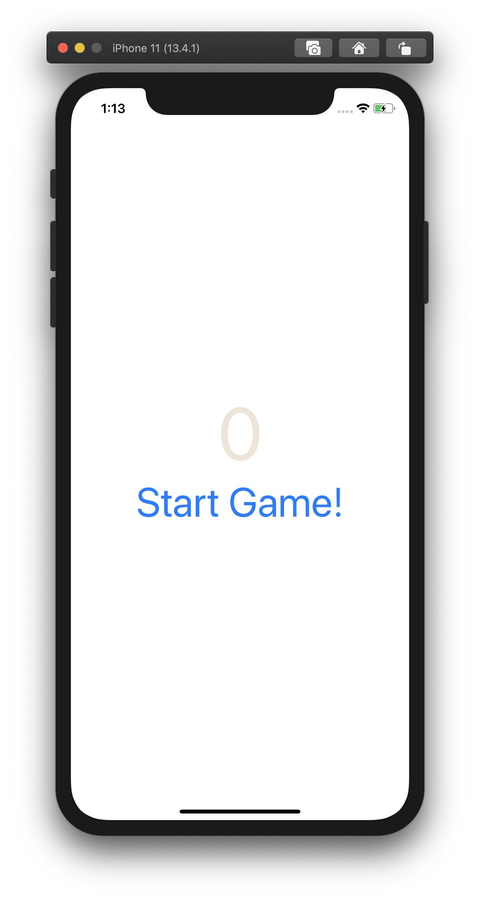
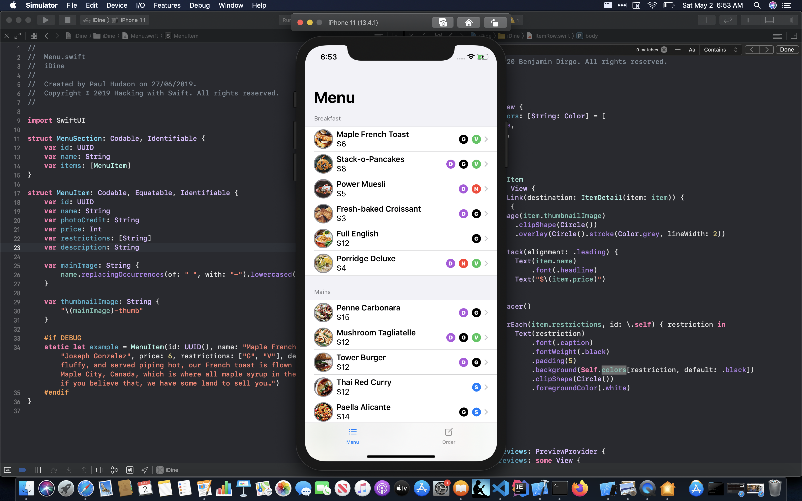

Hello, my name is Benjamin Dirgo. This is my personal website/blog. Take a look at my [github](https://github.com/bdirgo)

Here is a link to my [resume](./Benjamin_Dirgo_Resume_2020.pdf).

# Blog

[Tap Tap Unicorns](./blog/tap-tap-unicorns.md)

I wondered what the experience is in using SwiftUI to create the "Dissapearing Unicorns" app from a talk in [WWDC a few years ago](https://developer.apple.com/videos/play/wwdc2018/203/). SwiftUI has a simpler way to solve problems compared to UIKit in the presentation. I'm not sure what the CS term is for the two ways of programming apps in UIKit vs SwiftUI (MVC vs Functional?). Either way, you have to have a different mind set when creating an app with a storyboard vs an app with a SwiftUI component. Many of the house keeping things you need to keep track of in every function in a UIKit app (`button.isHidden = false`) are automatically done in a SwiftUI app. [...](./blog/tap-tap-unicorns.md)

[May 1, 2020](./blog/may-1md)
Status update

[April 30, 2020](./blog/april-30.md)

SwiftUI is fun :-) Finished the iDine app from Hacking with Swift, and I feel like it was a whirlwind tour of most of the new top level features in SwiftUI. It's a neat app, but I'd like to see how I will expand upon it. [...](./blog/april-30.md)

[April 29, 2020 - Day Three / 100 with SwiftUI](./blog/day-three-with-swift.md)

I have kept up with the one hour a day, but have found the topic to be a bit boring when just oging over syntax. So, I'm skipping a bit and following along the SwiftUI by Example sample project just to see all this in action. [...](./blog/day-three-with-swift.md)

[April 26, 2020 - One Hundred Days of SwiftUI](./blog/one-hundred-days-of-swift)

I have decided instead of trying to cram for an interview that I don't have lined up. I want to try and create an iPhone app as a side project. I have a few ideas, and I hope they can be fleshed out into real apps. [...](./blog/one-hundred-days-of-swift)