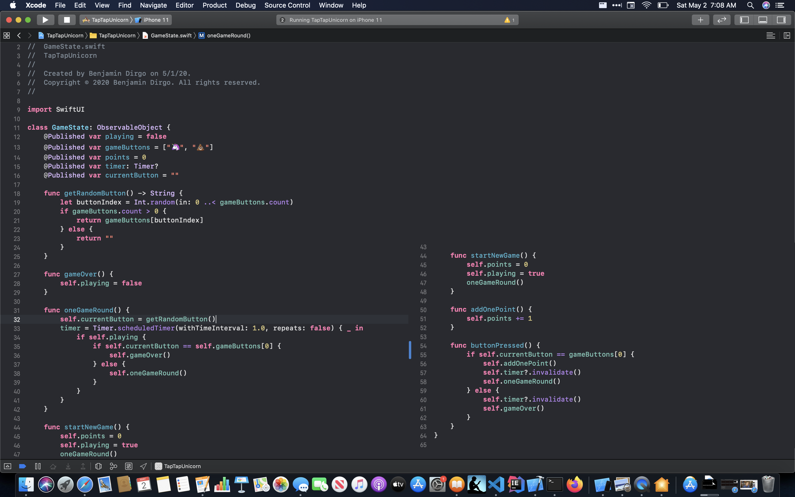
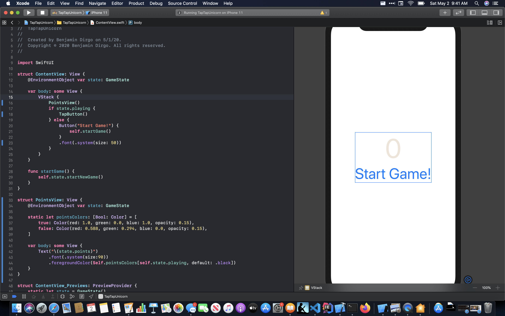

[Back](../README.md)
# Tap Tap Unicorns

I wondered what the experience is in using SwiftUI to create the "Dissapearing Unicorns" app from a talk in [WWDC a few years ago](https://developer.apple.com/videos/play/wwdc2018/203/). SwiftUI has a simpler way to solve problems compared to UIKit in the presentation. I'm not sure what the CS term is for the two ways of programming apps in UIKit vs SwiftUI (MVC vs Functional?). Either way, you have to have a different mind set when creating an app with a storyboard vs an app with a SwiftUI component. Many of the house keeping things you need to keep track of in every function in a UIKit app (`button.isHidden = false`) are automatically done in a SwiftUI app. 

The first big change between the two versions is instead of including all the methods in the viewController, we can create a class to hold the functionality. The viewController is now split in two, 'SwiftUI View' files only care about what the view looks like. And, our class files are where the "controlling" happens. I named my class "Game State" and is where most of the action of the game lives. All the different views will "subscribe" to changes in Game State with `@EnvironmentObject`, and `@Published`. Any time the state changes the `body` method is re-run updating that view. And fire off actions, such as on button presses, using methods in the Game State class. 

Many of the methods in the game state of Tap Tap Unicorn are more simple versions of the functions in the viewController of Dissapearing Unicorns. For example, `startNewGame()` will set points to 0, playing to true and start a new game round timer. Instead of keeping track of the state of individual buttons in every function call, we set the game state to `playing = true` and SwiftUI really takes care of changing the view. I thought the Timer would be hard to translate, but it was mostly copy paste.

Another idea that gets turned inside out is, setting up the default view. In Dissapearing Unicorns, we setup the starting contitions in `viewDidLoad()`. But in Tap Tap Unicorns, that setup is simply what values you give the Published variables in Game State.

Which leads to the last issue that I only kind of solved. If you add the button using deafult settings the button will randomly change between the two options, but they will be in the same spot everytime. Not much of a game. Taking a look at the [documentation](https://developer.apple.com/documentation/swiftui/text/view_modifiers) of how every view can be modified, we can add a position to that button. Now to figure out how to find the safe areas like in the tutorial. Looking around it looks like we can use [GeometryProxy](https://developer.apple.com/documentation/swiftui/geometryproxy) to get that information. But, I'm not sure exaclty how it works, it seems to be giving the area below the start button. Sometimes the location is off screen as well, so I'm pretty sure I'm using it wrong. You can see a screenshot of the code below. 

Overall it looks like it is easier to make this code using SwiftUI then UIKit. I need to look at how to use GeometryProxy correctly. I'd also like to look at getting this working on the watchOS, and iPadOS. 